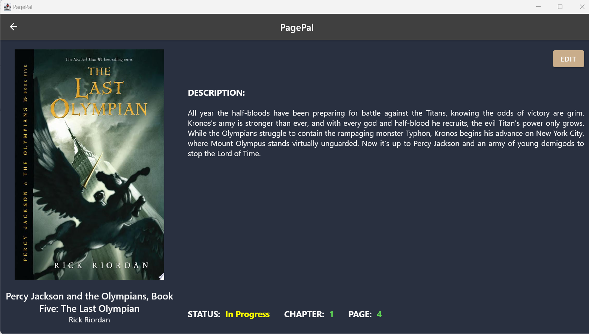

# Team-102-5

## PagePal Your Ultimate Reading Companion

### Overview:

Welcome to PagePal – the all-in-one application designed to transform your reading experience. In today’s fast-paced world, finding time to read and tracking your reading habits can be challenging. PagePal is here to simplify your literary journey, offering a seamless, integrated platform that caters to book lovers seeking to optimize and personalize their reading adventure.

With PagePal, you can track your reading progress, manage your book collection, receive AI-powered personalized book recommendations, and set reading goals. Our goal is to create a cohesive and satisfying reading experience for our users, making reading more accessible and enjoyable for everyone.

### Advanced Features:

We believe that we were able to achieve the following advanced features:
- Utilize data from an existing cloud service (e.g. search Twitter data; load image data from Google; lookup names of Pokemon on a custom REST service). See the list below for some potential APIs.
- Deploy your database to the cloud to store private data. Implement appropriate privacy/security measures (e.g. hashed and encrypted password; secure authentication using tokens).
- Support multi-user scenarios. This means supporting different users, each with their own data, stored in the cloud (must be paired with some cloud deployment, as above).
- Support single-user multi-device scenarios. This requires the ability to have your data shared across different instances of your application running concurrently (must be paired with some cloud deployment as above).

### Screenshots:

### Team Members:
1. Achille Desreumaux: adesreum@uwaterloo.ca
2. Aditya Parekh: a6parekh@uwaterloo.ca
3. Jithin Krishna: jjothikr@uwaterloo.ca
4. Praviin Premsankar: ppremsan@uwaterloo.ca

### User Documentation:

[User Documentation](../../wikis/User-Documentation)

### Design Documentation:

[Design Documentation](../../wikis/Design-Documentation)

### Release Notes:

[Release Notes](../../wikis/Release-Notes)

### Meeting Minutes

[Meeting Minutes](../../wikis/Meeting-Minutes)

### Development Journal

[Development Journal](../../wikis/Development-Journal)

### Reflections

[Reflections](../../wikis/Reflections)
